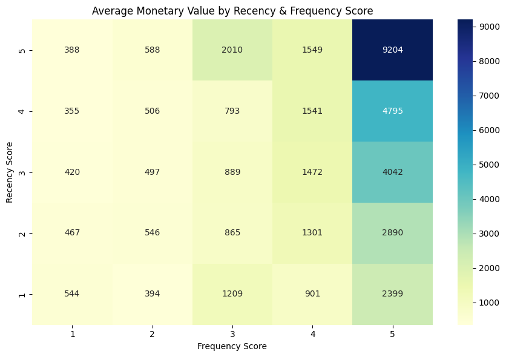

# RFM Customer Segmentation

## Overview
Segments ~4,338 customers from a UK-based online retailer using RFM 
(Recency, Frequency, Monetary) analysis to identify high-value and at-risk customers.

## Dataset
UCI Online Retail Dataset — 541,909 transactions, Dec 2010–Dec 2011.

## Tools
Python, Pandas, Seaborn, Matplotlib

## Process
1. Cleaned data (removed missing CustomerIDs, returns/cancellations)
2. Calculated Recency, Frequency, Monetary per customer
3. Scored customers 1-5 on each metric using quintiles
4. Segmented into Champions, Loyal, At Risk, Lost, etc.
5. Visualized segment sizes, RFM heatmap, revenue trend, and Frequency vs Monetary scatter

## Key Findings
- Champions (19% of customers) generate the highest average revenue (£6,713)
- At Risk customers hold ~3x the historical spend of Lost customers, 
  making them the priority group for retention campaigns

## Files
- `rfm_analysis.ipynb` — full analysis notebook
- `rfm_segmentation_output.csv` — final segmented customer data
- `bar chart.png`, `heatmap.png`, `line chart.png`, `dot chart.png` — visualizations

## Charts

